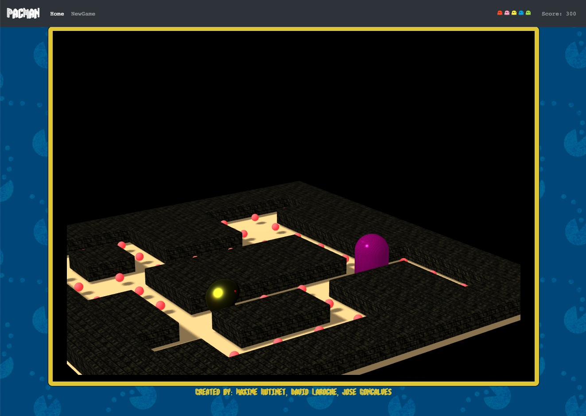

# PACMAN

This project is an implementation of the game Pacman in 3D using Three.JS.



## How to run the project ?

### Requirements

To run the project, the followings must be installed on the machine :

* [Docker](https://docs.docker.com/docker-for-mac/)
* [Docker-compose](https://docs.docker.com/compose/install/)
* Firefox : it is important to run the game with this browser as certain functionnalitie are only compatible with it.

### Running the project

1. Clone the repository

2. Run Docker Compose with the following command

```bash
docker-compose up -d
```

3. Open a browser and navigate to `localhost` or `127.0.0.1`